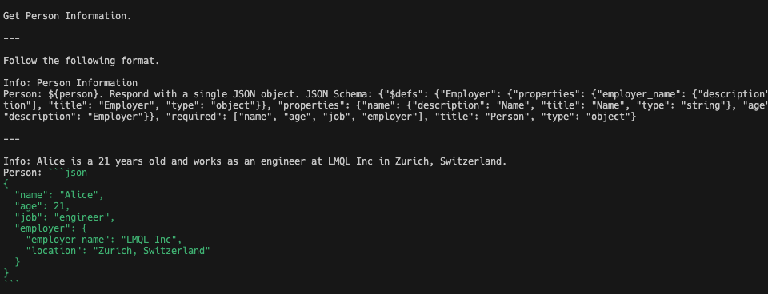

# MTLLM Evaluation

## Evaluation Methodology
We are evaluating a DSpy, LMQL and Jaclang's MTLLM Feature on problem set of different difficulty levels based on the
technique used and difficulty of the problem itself. There are 3 difficulty levels of problems:
- Easy
    - Problems that can be solved using simple prompt-based techniques. eg. `Translation`, `Summarization`
- Medium
    - Problems that require some level of understanding of the problem and the data. eg. `Text Classification`, `Named Entity Recognition`, `Question Answering`
- Hard
    - Problems that require a deep understanding of the problem and the data. eg. `Agents`, `Tool Usage`, `ReACT`

## Evaluation Metrics
We are evaluating DSpy, LMQL and Jaclang's MTLLM Feature on the following metrics:
- Overall Accuracy - The overall accuracy of the model on the problem set.
- Time Taken to Solve the Problem - The time taken to solve the problem.
- Readability of the Code - The readability of the code. (Human Evaluation)
- Number of Lines - The number of lines in the written. (After Formatting)
- Token Usage - The number of tokens used by the LLMs.
- How Good it work good with different LLMs - The performance of the model on different LLMs.
    - OpenAI's GPT-3.5, GPT-4, GPT-4-llm, GPT-4o
    - Anthrpic's Claude 3 (Sonnet, Opus)
    - Google's Gemini Models
    - OpenSource (LLama3 (8b, 70b), Mistral, Mixtral, Phi-3)

## Evaluation Results

### Easy Problems

| Problem Name | Methodology | Runtime (s) | Readability | Number of Lines |
| ------------ | ----------- | ---------- | ----------- | --------------- |
| Odd Word Out | DSpy | 8.89 |  | 49 |
|  | LMQL | 1.86 |  | 23 |
|  | Jaclang | `1.25` |  | `15` |
| Joke Generation | DSpy | 3.21 |  | 37 |
|  | LMQL | 2.84 |  | 19 |
|  | Jaclang | `1.62` |  | `16` |
| Translation | DSpy | 3.39 |  | 40 |
|  | LMQL | 1.38 |  | 18 |
|  | Jaclang | `0.97` |  | `16` |
| Expert Answer | DSpy | `4.15` |  | 25 |
|  | LMQL | 6.65 |  | 20 |
|  | Jaclang | 8.04 |  | `15` |
| Essay Reviewer | DSpy | 17.80 |  | 66 |
|  | LMQL |  |  |  |
|  | Jaclang | `8.72` |  | `36` |


### Medium Problems

| Problem Name | Methodology | Runtime (s) | Readability | Number of Lines |
| ------------ | ----------- | ---------- | ----------- | --------------- |
| MCQ Reasoning | DSpy | 4.55 |  | `20` |
|  | LMQL | 3.56 |  | 21 |
|  | Jaclang | `2.05` |  | `20` |
| Text to Type | DSpy | 2.70 |  | 29 |
|  | LMQL | 3.01 |  | 30 |
|  | Jaclang | `1.73` |  | `23` |
| Template | DSpy | 1.04 |  | 26 |
|  | LMQL | - |  | - |
|  | Jaclang | `1.36` |  | `17` |
| Personality Finder | DSpy | `1.06` |  | 31 |
|  | LMQL | - |  | - |
|  | Jaclang | 1.77 |  | `25` |

### Hard Problems

| Problem Name | Methodology | Runtime (s) | Readability | Number of Lines |
| ------------ | ----------- | ---------- | ----------- | --------------- |
| Wikipedia (ReACT) | DSpy | 10.76 |  | 31 |
|  | LMQL | - |  | - |
|  | Jaclang | `8.73` |  | `61` |
| RPG Level Generation | DSpy | - |  | 120 |
|  | LMQL |  |  |  |
|  | Jaclang | **31.99** |  | **110** |


## Issues Encountered
### DSPy
1. Handling Examples in DSPy is very difficult as everything need to created using classes. This makes it difficult to handle simple problems. and always the examples need to be structured in a way that it can be used in a class.
2. Unable to provide additional context as everything need to be in the docstring. and the docstring is not very flexible to handle additional context.
3. As the Typed Output are handled as a JSON String and the Type Information is provided as a JSON Schema. When it comes to complex types, it is very difficult to handle them. (eg- level_generation)

4. It doesnt support some LLMs like Anthropic's Claude 3, Google's Gemini Models
5. Able to use chat models but the prompt generation is not optimized for that. Works well with completion models. which are currently getting deprecated.
6. Even for small problems need a lot of code to be written and everytime need to create a class for the problem.
7. Hard to Debug as the error messages are not very clear

### LMQL
1. Very Hard to write the LMQL code as it is very difficult to understand the syntax.
2. It feels more of prompting than writing code.
3. Difficult to handle complex types as there is no mechanism to handle them.
4. Its uses logit based approach for text generation, which is expensive and slow. Most of the models doesn't support logit based approach.
5. Hard to Debug as the error messages are not very clear

## How to run the evaluation
1. Clone the repository
2. Set the following environment variables based on the LLMs you are using
```bash
export OPENAI_API_KEY=<API_KEY>
```
3. Run the following command
```bash
python eval.py --profiler "cProfile"/"pyinstrument"
```
4. Evaluation Results will be saved in `results` folder
5. To view profiling results, run the following command
```bash
# if used pyinstrument
Double click on the `profile.html` file in the `results` folder
# if used cProfile
snakeviz <path_to_cprofile_output(profile.prof)>
gprof2dot -f pstats <path_to_cprofile_output(profile.prof)> -o <output_dot_file>
Open the generated dot file in a dot viewer of your choice
```

If you need to track the token usages, you can make the following changes in relevant files
```python
# file: dsp/modules/gpt3.py
# line: 185 Add the following
print(response.get("usage"))
```
```python
# file: jaclang/core/llms/openai.py
# line: 61 Add the following
print(output.usage)
```
Token Usage will be recorded in the relevant results.txt files.